

CURSO: MINERÍA DE DATOS

MAESTRÍA EN EXPLOTACIÓN DE DATOS Y DESCUBRIMIENTO
DE CONOCIMIENTO

# Música y Pandemia:  
¿Fueron diferentes el 2019 y el 2020? (segunda parte)

        

TRABAJO PRÁCTICO ENTREGABLE II  
Reglas de Asociación

### Data Mining

Explotación de Datos y Descubrimiento de
Conocimiento

Grupo 6,
Integrantes: Guadalupe Alonso, Macarena
Roel, Clara Villalba

-----

### Resumen 

En este trabaja en el análisis de texto de las letras
de las canciones más reproducidas en Spotify para los años 2019 y 2020.
Se realiza una integración con las características y cantidad de
reproducciones de las canciones, para evaluar desde otra perspectiva la
hipótesis planteada en el trabajo anterior. Los resultados que se
muestran indican que no las letras de las canciones no aportan nueva
información a la diferenciación entre un año y otro. Por otro lado, en
el trabajo anterior se obtuvieron indicadores útiles para la
clasificación de canciones. En este trabajo se parte de esos resultados
y se estudia la terminología y reglas de asociación presentes en
canciones clasificadas de acuerdo a su persistencia en los rankings de
reproducciones y el valor de la primera componente obtenida en PCA. Como
resultado de este análisis, se ve que la temática principal de las
canciones de mayor reproducción en ambos años es el amor. Si uno
considera la diferenciación entre temas de ‘éxitos’ y ‘clásicos’ se
encuentran indicios de que el enfoque sobre el amor es distinto en un
caso que en el otro. Por último, no pudo distinguirse un léxico
característico de las canciones energéticas. 

### Introducción 

En el trabajo práctico anterior, se realizó un
análisis exploratorio de las canciones más reproducidas en Spotify,
enfocado principalmente en cuantificar diferencias entre los años 2019 y
2020, con el objetivo de estudiar el impacto potencial de la pandemia de
covid en la manera de escuchar música. Se estudiaron las series
temporales de cantidad de reproducciones y se compararon las
características de ambos años. Para caracterizar la popularidad de cada
canción, se definió la variable persistencia en los charts que
cuantifica la permanencia en semanas entre la lista de mayores
reproducciones. La variable resultó de gran información respecto a la
clasificación de popularidad de las canciones. Por último, se realizó un
análisis de componentes principales sobre las características de las
canciones más escuchadas de cada año.  Algunos de los resultados del
trabajo anterior se utilizan en este trabajo como disparadores de nuevas
preguntas a responder incorporando nueva información: las letras de las
canciones. 

La conclusión general del trabajo anterior fue que
no hay una diferenciación clara entre los años 2019 y 2020 en base a la
cantidad de reproducciones o a las características de las canciones más
reproducidas semanalmente. El primer objetivo de este trabajo es
confirmar o refutar esta conclusión utilizando las particularidades de
las letras de las canciones. 

Además de cuantificar y analizar las diferencias
entre los años estudiados, en el trabajo anterior también se exploraron
formas efectivas de caracterización de canciones populares. En ese
sentido, se obtuvieron resultados satisfactorios con la variable
persistencia y con las primeras componentes obtenidas en el análisis
PCA. No fueron exploradas con profundidad en el trabajo anterior, dado
que no aportaron a la discriminación entre 2019 y 2020. Como segundo
objetivo de este trabajo, se propone analizar si las caracterizaciones
de las canciones en función de persistencia o métrica que explica mayor
variabilidad, tienen su correspondencia en las letras de las canciones.
En concreto, se proponen tres grandes preguntas:

1.  ¿Comparten la misma terminología las canciones 2019
    y 2020? ¿Son similares las reglas de asociación  presentes en las
    letras de canciones 2019 y
    2020?
2.  A partir de la definición de persistencia y su
    relación con las mejores y peores posiciones de cada canción, en el
    trabajo anterior se diferenciaron tres tipos de canciones de acuerdo
    a su vigencia. ¿Cuál es el tipo de canción de acuerdo a esta
    categorización? ¿Son comunes las palabras más frecuentes dentro de
    las letras entre estos tipos? ¿Cuáles son las reglas de asociación
    dentro de las canciones más persistentes de ambos años?
3.  Considerando resultados de PCA, tomamos el
    feature correspondiente al primer componente principal y
    analizaremos dos extremos: los más acústicos y los más energéticos.
    En estos extremos,  ¿cómo varían las reglas de asociación? ¿Se
    encuentran los mismos términos y cantidad de reglas?

Podría considerarse que las preguntas 2 y 3 son de
la misma naturaleza, en el sentido de que buscan explorar reglas de
asociación entre letras de canciones que comparten alguna característica
particular (tipo de persistencia o si es o no acústica). Con el fin de
explorar los tipos de metodologías posibles, para responder cada una de
ellas se utilizarán estrategias ligeramente diferentes. 

El trabajo está organizado en XX secciones: en la
primera de ellas se presentan los datos nuevos utilizados, el
pre-procesamiento y obtención general de los mismos. Luego, se destina
una sección a cada una de las preguntas planteadas, detallando las
modificaciones particulares sobre la base de datos, integraciones con
las colecciones del trabajo anterior, parámetros utilizados y
procedimientos específicos requeridos por el tipo de pregunta a evaluar.
En la última sección se resumirá los resultados del trabajo, las
conclusiones y recomendaciones para investigaciones futuras.

### Datos Utilizados

La información proveniente de la plataforma fue
extraída y brindada por los docentes de la materia en un archivo JSON.
Para la exploración de estos temas, se utilizará el IDE RStudio del
lenguaje de programación R y la Base de Datos MongoDB. Se generó
utilizando Mongodb se agregaron a la base de datos ‘SPOTIFY\_DM’,
la colección “LYRICS” con las letras de las
canciones. De acuerdo al interés de este
trabajo, en esta sección el foco está sobre esta última colección. Una
descripción acabada sobre las otras colecciones de la base de datos
puede encontrarse en el TP anterior.

A continuación se presenta el proceso de
tokenización para obtener la colección de documentos sobre la que se
trabajará en las secciones siguientes. Se detallan las tareas de
normalización y  los criterios implementados en la limpieza de los
textos. Además, se presentan algunas características generales de la
colección a manera descriptiva.

La integración entre ‘Lyrics’ y cualquiera de las
variables producidas en el trabajo anterior, se realiza a partir de la
coincidencia de los campos ‘track name’ y ‘artist\_name’.  En principio
‘Lyrics’ cuenta con 3375 observaciones, de las cuales solamente 694
son valores únicos de la combinación ‘track\_name’ y ‘artist\_name’. Del
trabajo anterior se contaba con información de 1932 canciones que
aparecen al menos una vez en ‘charts’ para el periodo 2019-2020, luego
de la integración quedan unas 485
para las que se cuenta con la letra de la
canción.

Para facilitar la tokenización del texto de las
canciones hicimos una división en canciones de acuerdo al idioma en
español e inglés. En total quedaron
167 registros únicos
para las lyrics en español
y 527 para
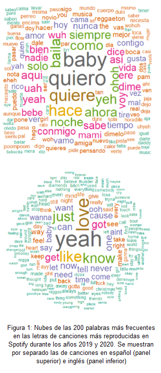inglés.
De acuerdo a lo visto en la materia, se utilizó el paquete
Text Mining (tm) que es
una herramienta poderosa para el proceso inicial de manipulación de
documentos de texto. En primer lugar se generan los corpus para cada
idioma, se elimina la parte del texto de encabezado y pie de cada
canción, así como también los comentarios que no pertenecen a la letra
de la canción (por ejemplo: ‘\[Pre-Coro: Sebastián Yatra & Joey
Montana\], se remueven las palabras vacías, valores numéricos,
puntuaciones, caracteres que no sean letras y las mayúsculas. Para tener
una primera visión de los corpus procesados, en la Figura
1 se muestra la nube de
las 200 palabras más frecuentes en las canciones de ambos idiomas. Se
nota que hay entre las palabras más frecuentes, algunas cuya raíz es
compartida (como “quiero/quiere” o “wanna/want”). Además, algunas
palabras que podrían considerarse como vacías de información como
 “ohoh” o “yeah”. Esto sería indicador de que es necesario aplicar
una técnica de stemming para consolidar palabras con la misma raíz como
única. 

La remoción de palabras vacías fue un proceso
reiterativo, removiendo primero aquellas palabras obvias y luego al
realizar el análisis repetidas veces quitando aquellas que generaban
ruido pero no aportaban al análisis (por ejemplo, las malas
palabras).

El pre procesamiento realizado para los corpus en
español consistió en el agregado de palabras  a las Stopwords de la
librería que consideramos no aportan al análisis como es el caso de las
onomatopeyas por ejemplo, 'wohoh', 'woh', 'jaja', 'yeh', 'uah', 'ohoh',
'yah', 'yeah'. Además si bien este corpus está formado por palabras en
español, aparecen algunas palabras en Inglés, por lo que también
agregamos las Stopwords en inglés a este procesamiento. Respecto al uso
de Stemming, probamos de las dos maneras, usándolo y no usándolo. En
español encontramos palabras como quiere y quiero, que aparecen con
mucha frecuencia por lo que decidimos consolidar estas palabras
relacionadas con la misma raíz. usando Stemming.

El preprocesamiento del corpus en Inglés, se realizó
de igual manera que el español, pero se utilizaron los Stopword en
inglés de la librería SnowballC  agregándoles algunas palabras vacías
como 'got', 'get', 'let', 'ooh', 'yeah', 'will', 'gon', 'aint', 'wanna',
'caus'. Una diferencia importante que notamos en este punto, es que las
palabras del corpus en Inglés contenían muchas malas palabras por eso
también las agregamos a la lista de Stopwords para dejarlas fuera de
este análisis. En este caso probamos usando Stemming y no usandolo, pero
al tratarse de otro idioma, muchas reglas quedaban inentendibles, por
los tanto para el resto del análisis sobre los corpus en inglés
decidimos no utilizarlo

### Comparación 2019/2020 

Siguiendo con la temática planteada en el primer TP
decidimos comparar las canciones del 2019 contra las del 2020. Para esto
utilizamos el archivo unificado de Features en Charts generado en el
primer trabajo, donde nos quedamos solo con los features de las
canciones que aparecían al menos una vez en charts tomando como clave
“track\_name” y “artist”. Respecto a este archivo el único
preprocesamiento realizado en esta etapa  fue dividirlo en dos, uno que
contenga las canciones que estuvieron en charts en el 2019 y otro en el
2020. 

Como nuestro objetivo en este punto es dividir
 estas canciones entre las que estuvieron en chart en el 2019 y 2020,
joineamos ambos archivos con cada subarchivo de features en charts.  A
continuación generamos un corpus por cada año, y por cada idioma. Es
decir en total generamos 4 corpus, uno para 2019 español, otro para
 2019 Inglés, 2020 español y  2020 inglés. 

A continuación generamos la matriz término documento
para cada corpus  usando  ponderación de frecuencia de término
("weightTf"). Quedaron  2371 términos en la
matriz 2019-español, 2501 términos en la matriz 2020-español, 4232
términos en 2019-español y 4708 en 2020-Inglés. Luego analizamos la
frecuencia de los términos del corpus. En la Figura 2 se pueden observar
las 25 palabras más frecuentes en cada corpus. Podemos destacar que en
ambos corpus español e inglés aparecen las palabras de “temática”
parecida: quiero y love con mayor frecuencia.

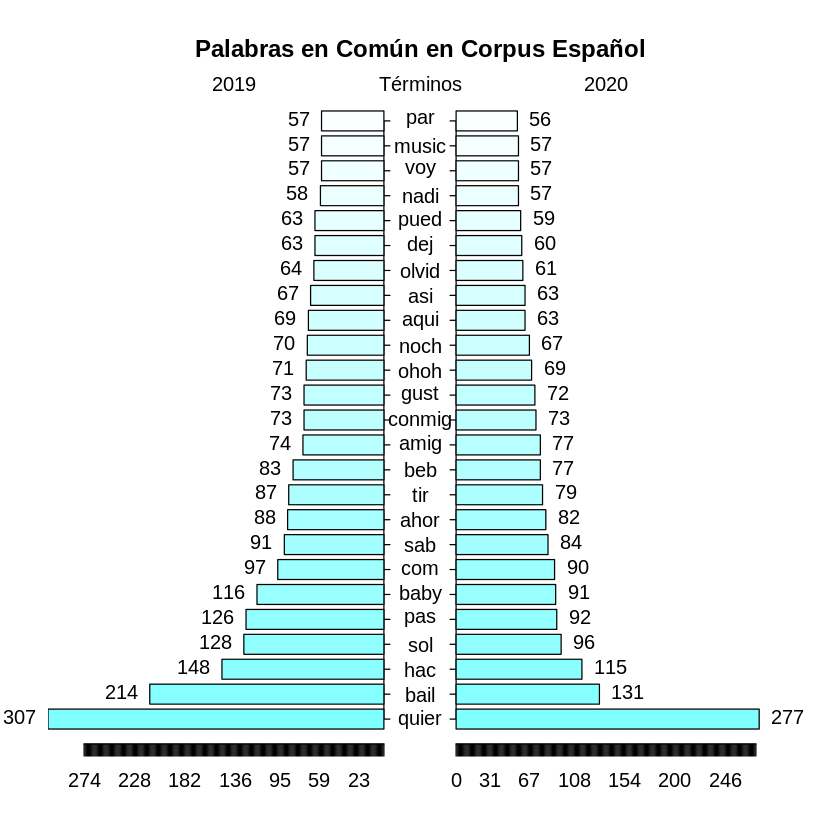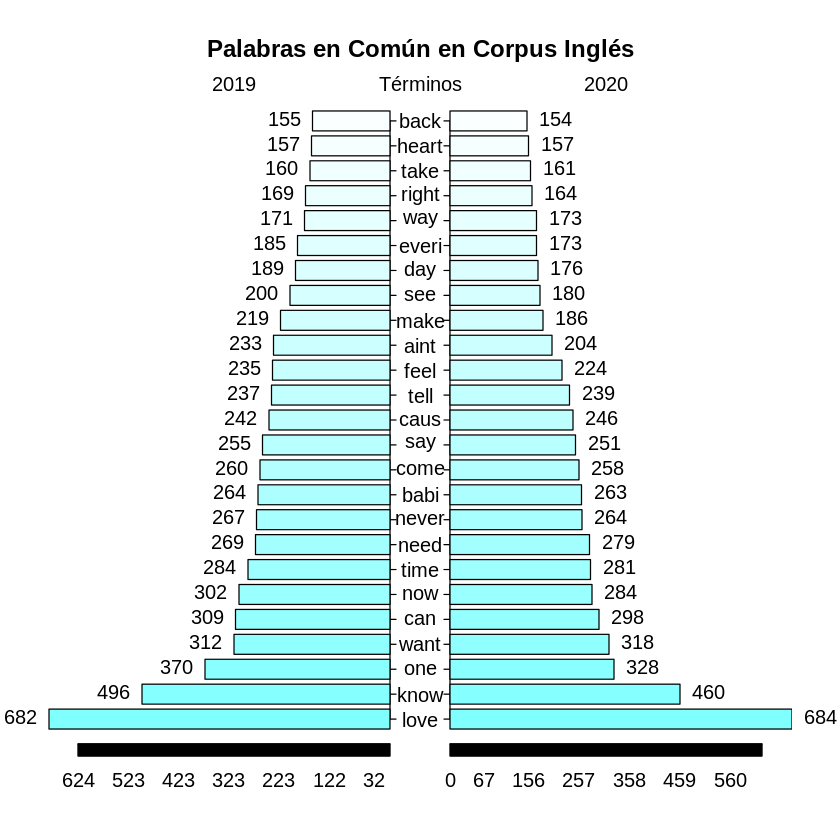

Figura 2: Análisis de las 25 palabras en común y
más frecuentes en los corpus utilizados.

         Una vez generadas
las matrices TD, las convertimos en transacciones usando la librería
arules de R  y generamos las reglas con el algoritmo
apriori usando los
parámetros por default support=0.1,
confidence=0.8. En los corpus en español obtuvimos un valor máximo de
lift igual a  6.0 y en el de inglés un lift máximo de 2.0. Tomamos un
subset de 10 reglas con mayor lift para  cada
uno de los corpus analizados y las graficamos. En  la Figura 3 se
detallan estas reglas,las que tienen un color rojo más intenso son las
de mayor confianza, se las describen en el pie de cada figura para mayor
claridad.

<table>
<colgroup>
<col style="width: 50%" />
<col style="width: 50%" />
</colgroup>
<tbody>
<tr class="odd">
<td>
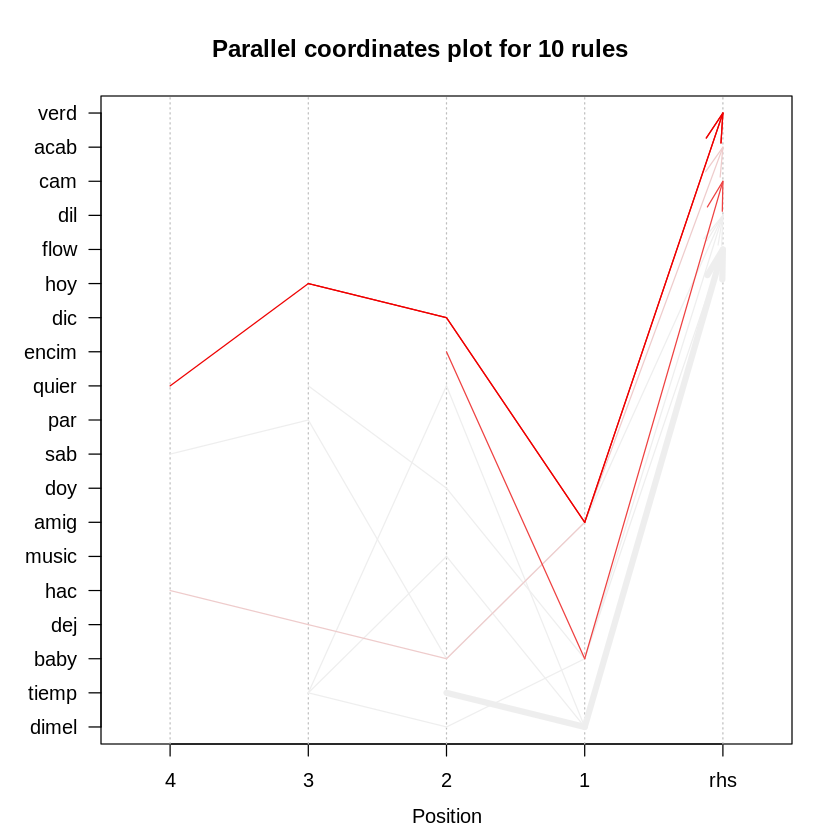

Corpus de 2019 - Español. Reglas con mayor confianza:

{amig,dic,hoy}  =&gt; {verd}  y  {amig,dic,hoy,quier}  =&gt; {verd} 
</td>
<td>
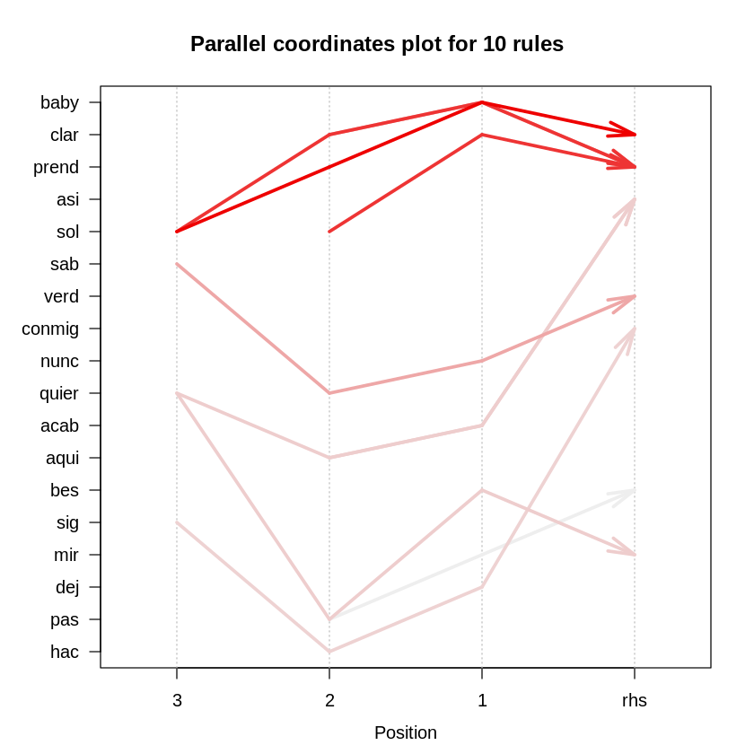

Corpus 2020-Español. Reglas con mayor confianza:

{clar,sol} =&gt; {prend}, {baby,clar,sol}  =&gt; {prend} y 

{sol, baby} =&gt; {prend}.
</td>
</tr>
<tr class="even">
<td>
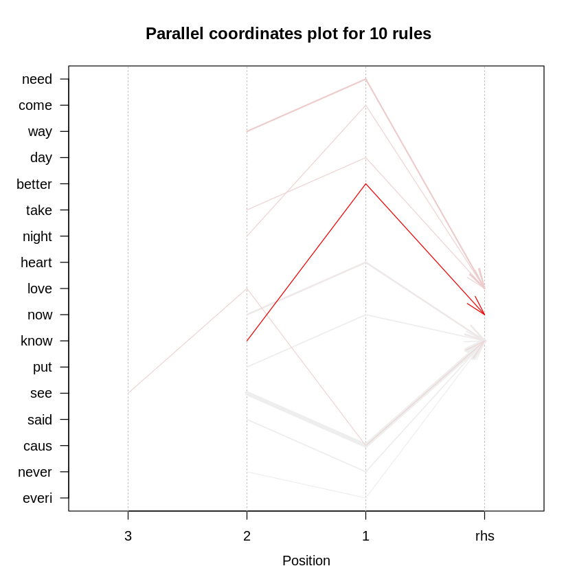

Corpus 2019 - Inglés. Reglas con mayor confianza: 

{better,know} =&gt; {now} y {need,way} =&gt; {love}
</td>
<td>
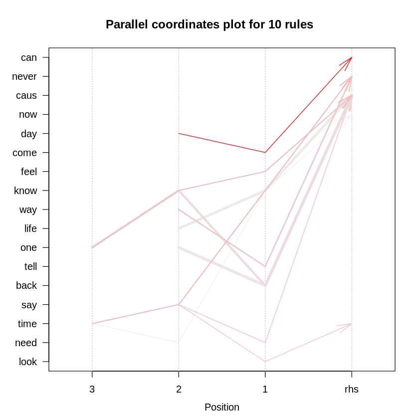

Corpus 2020 - Inglés. Reglas con mayor confianza:

{come,day}=&gt; {can} y {know,say,time}=&gt; {never} 
</td>
</tr>
</tbody>
</table>

Figura 3: Gráficos de las 10  reglas  con
mayor lift en cada uno de los corpus

### Comparación con persistencia

La “persistencia”, definida en el trabajo anterior,
mide el número de semanas que cierta canción permaneció dentro de las
200 canciones más reproducidas semanalmente en Spotify durante los años
2019 y 2020. Del análisis de esta variable junto con las mejores y
peores posiciones alcanzadas por cada canción, se distinguen tres tipos
de canciones con alta persistencia: aquellas que pasan por todas las
posiciones dentro de los charts, las que permanecen en bajas posiciones
y las que se mantienen en posiciones altas para luego desaparecer (ver
Figura 7, TP1). Nos referiremos a estos grupos como ‘éxitos’, ‘clásicos’
y ‘hits’.

En esta sección, la estrategia elegida para el
análisis de letras y búsqueda de reglas de asociación sobre los grupos
es la de analizar los grupos por separado. Es decir, se fijan umbrales
para la determinación de las canciones que pertenecen a un grupo y a
otro. Siempre considerando una persistencia mayor a 8 semanas, se
dividen los grupos en ‘clásicos’ (mejor posición está por debajo de
100), ‘éxitos’ (mejor posición por encima de 20 y peor posición por
debajo de 100) y ‘hits’ (mejor posición por encima de 20 y peor posición
mayor a 50). Como resultado se tienen 57 canciones en ‘clásicos’ (67%
son en inglés), 79 (78% son en inglés) en ‘éxitos’ y 10 en ‘hits’ (90%
en inglés). Al ser la mayoría de cada conjunto, se  analizarán las
letras de las canciones en inglés.

       Para la obtención de los tres corpus para el
análisis de cada tipo de canciones, se siguió la metodología descrita
en la sección Datos Utilizados. La excepción fue que no fue necesario
remover malas palabras o jerga, dado que no tienen una frecuencia
significativa en los conjuntos estudiados en esta sección. Los conjuntos
no tienen canciones en común, pero si se contabiliza la terminología
utilizada en las letras, se encuentra gran coincidencia en las palabras
más frecuentes de todos los conjuntos. En la Figura 4 se muestran las
palabras más utilizadas en los conjuntos analizados y puede verse que,
si bien las palabras son las mismas, la distribución de frecuencias no
es igual en ‘clásicos’ que en ‘éxitos’. Si bien es un conjunto muy
pequeño, es de notar que para el conjunto ‘éxitos’ la palabra
love no es la más
frecuente. A excepción de
wanna/want no se
nota una presencia marcada de palabras cuya raíz sea compartida. Para
investigar el uso de las palabras en las letras de las canciones de cada
conjunto, se explorarán las reglas de asociación que surgen de cada
conjunto.

     
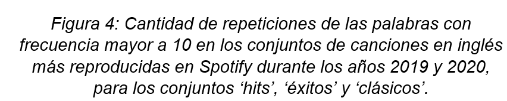Respecto
a los parámetros para definir la búsqueda de reglas de asociación, se
prioriza buscar reglas cuya confianza sea mayor a 0.8 y cuyo itemset
aparezca en al menos 5 canciones. Esto significa que
el support mínimo
para el conjunto de ‘clásicos’ se fijó en 0.15, en 0.1 para ‘éxitos’ y
en 0.5 para ‘hits’. Se encontraron 2 reglas para las letras en ‘éxitos’
y 114 reglas no redundantes para ‘clásicos’. Utilizando la
implementación en R del algoritmo
apriori, con
estos parámetros se obtienen para ‘éxitos’ 232 reglas, 22 para
‘clásicos’ y solo 2 reglas para ‘hits’. 

De las reglas de asociación encontradas en ‘éxitos’,
tienen como palabras consecuentes los términos más frecuentes en el
corpus. Las reglas halladas tienen una longitud máxima de 4 items. Las
reglas con mayor valor de lift
para este conjunto tienen como antecedentes
{one, time, wanna} / {aint, wanna} y como consecuente {baby}. El valor
de lift para las
reglas encontradas está entre 1.27 y 3.01. Para el conjunto de
‘clásicos’, las reglas de asociación encontradas tienen una
longitud máxima de 3 y los valores de
lift están entre
1.58 y 3.17. Si bien ‘love’ es un término muy frecuente, no aparece como
consecuencia en ninguna de las reglas de asociación encontradas y
solamente en una de ellas en el conjunto de antecedentes ({baby, love} →
{never}, support:0.16, confidence: 0.86 y lift: 1.63).  En el conjunto
de canciones ‘hits’ se encontraron sólo
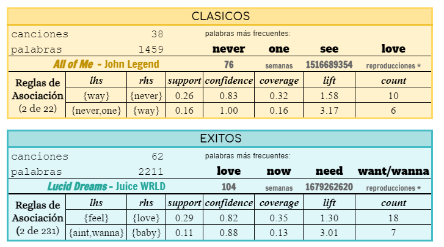dos
reglas que relacionan los términos ‘said’ y ‘never' (support: 0.56,
confidence: 0.83, coverage: 0.67 y lift:
1.25). 

Figura 5: Tablas de información resumida para los
conjuntos de canciones en inglés ‘clásicos’ y ‘éxitos’ de 2019 y 2020.
Se muestra en cada caso la canción más persistente.
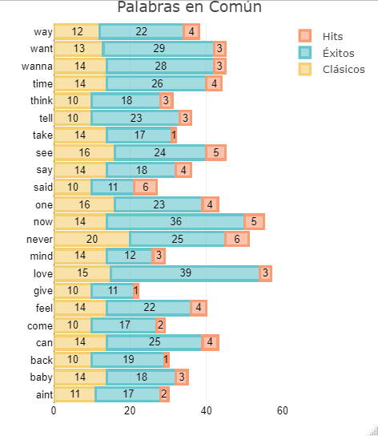

### Comparación con PCA 

Por otra parte, continuando con la línea de análisis
propuesta en el trabajo práctico anterior, se utilizó el valor de cada
canción en el primer componente del análisis de componentes principales
para generar nuevas reglas de asociación. 

El análisis se realizó utilizando los datos de las
canciones que se encontraron en el top 50 en el 2019 o 2020
(n = 537), y las
variables consideradas para el mismo fueron "acousticness", "valence",
"danceability", "energy", "liveness", "loudness" y "speechiness".

Se había observado que el primer componente
principal explicaba el 38.2% de la variabilidad observada entre los
datos, y que, considerando la importancia de cada variable para el
mismo, podría tomarse como un eje cuyos extremos eran acústicos o
energéticos. Esto quiere decir que aquellas canciones con valores más
pequeños en este primer componente principal pueden considerarse más
acústicas que aquellas con valores mayores.

En este análisis de reglas de asociación, se decidió
categorizar los valores obtenidos en el primer componente principal en 4
categorías, dividiendo a las 537 canciones en "Muy Acústicas",
"Moderadas a Acústicas", "Moderadas a Energéticas"y "Muy Energéticas"
según el cuartil al que pertenecían. Se tomó en consideración el hecho
de que las canciones populares suelen tender a ser más energéticas que
acústicas, se consideró que la categorización aportaba más información
de la que quitaba, y que debía interpretarse como la simplificación que
es y no como un dictamen absoluto del tipo de canción.

Para unir la información de las canciones con sus
letras, se generó un set de datos de las letras tanto en inglés como en
español, previo filtrado de canciones repetidas en ambos sets. Se
terminó obteniendo un set de 1361 letras de canciones. El mismo se unió
a las canciones que se habían encontrado en el top 50 en alguno de los
dos años, obteniéndose así un set de
datos
de 377 canciones con sus
letras. La proporción de 25% de canciones por grupo Acústico-Energético
se [\[1\]](#ftnt1)mantuvo luego de
la reducción del set de datos, lo que comprobó que la falta de algunas
letras no se debía al tipo de canción si no a otros factores
aleatorios.

Posteriormente se generó el corpus y se le realizó
un preprocesamiento, incluyendo quitar comentarios y signos de
puntuación de los mismos, quitar valores no alfanuméricos y trailing
spaces, y realizar stemming. Esta última decisión fue tomada luego de
analizar el corpus crudo la primera vez, luego de notar que en el mismo
se encontraban muchas repeticiones de la misma palabra, ya sea con
variedades conceptuales del estilo "amor", "amar", "amada" o por el mero
hecho de alargar las palabras sin sentido por motivos estéticos de la
canción (como ser el hecho de "zombie", "zombiee" y
"zombieieieie").

A su vez se configuró la remoción de palabras vacías
en ambos idiomas. Se consideró el caso de que, al trabajar con español e
inglés a la vez, lo que se considera una palabra vacía en uno de ellos
puede no serlo para el otro, pero que dicho caso es lo suficientemente
extraño como para no afectar en gran medida a los resultados
obtenidos.

Una vez conformes con el pre filtrado realizado, las
5 palabras con mayor frecuencia fueron lov (852 apariciones), want (586
apariciones), now (500 apariciones),  babi (476 apariciones) y one (467
apariciones) 

Posteriormente, se generaron las reglas de
asociación, utilizando un soporte de 0.1 y una confianza de 0.6. Con
dichos parámetros se obtienen 73 reglas de asociación, pero al aumentar
el valor de la confianza al 0.7 el número cae a 3. Aún así, el lift
alcanzó valores relativamente bajos, con un mínimo de 1.27 y un máximo
de 2.24. 

Sin embargo, fue necesario disminuir aún más la
confianza, a un valor de 0.4, para obtener reglas que incluyeran a los
grupos dicotomizados. Se intentó en una primera instancia generar reglas
para aquellos grupos “Energéticas”, es decir, “Moderado a Energéticas” y
“Muy Energéticas” por un lado, y “Acústicas” (“Moderado a Acústicas” y
“Muy Acústicas”) por el otro, pero se obtuvieron muy pocas reglas para
cada uno (3 y 13, respectivamente). 

Por ende, se decidió generar las reglas de
asociación con el término pca\_dic, es decir, aquellas que contengan
alguno de los términos del nivel energético generados. Las 16 reglas
resultantes, con lifts no mayores a 1. 38, todas en inglés, proveen un
panorama interesante de la asociación entre nivel energético y otros
términos.  

A pesar de encontrarnos con un bajo número de reglas
para las canciones Energéticas, la Figuras 6 y 7 permiten generar
algunos comentarios sobre los términos más utilizados en las canciones
más acústicas. 

Antes de comenzar el análisis, consideramos
necesario recordar nuevamente los valores menos que ideales de confianza
y lift, que hacen considerar que las asociaciones se dan 

|                                                                                                                                                                                                                                                                              |
| ---------------------------------------------------------------------------------------------------------------------------------------------------------------------------------------------------------------------------------------------------------------------------- |
| 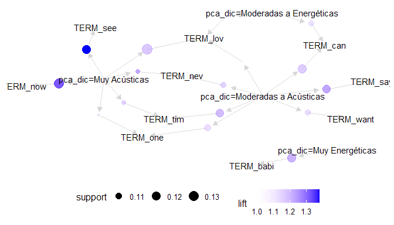 |
| Figura 7: Grafo de asociación entre los términos y los tipos de canción, coloreados por su lift y con el tamaño del círculo indicando su support                                                                                            |

puramente por azar y no porque realmente exista una
asociación entre las mismas.

Sin embargo, si uno decide tomar estos valores como
asociaciones reales, encontramos que las canciones con tendencia a ser
acústicas muestran un patrón interesante de vocabulario: hablan de
necesidades y emociones, algo esperado para  acústicas, pero también
hablan del tiempo: “time”, “never” y “now” fueron términos encontrados
frecuentemente. 

Todos los términos descubiertos habían sido
mencionados como frecuentes en los análisis exploratorios anteriores,
pero si no dependieran para nada del tipo de canción esperaríamos
encontrar estas reglas de asociación presentes también en las canciones
energéticas.

Las Figuras 6 y 7 permiten ver gráficamente estas
diferencias, mostrando la asociación entre los diferentes términos, y
como “Muy Acústicas” y “Moderadas a Acústicas” se encuentran fuertemente
relacionadas, mientras que la relación con “Moderadas a Energéticas” ya
era menor y por último no se encontraron términos en común con “Muy
Energéticas”.

Sería interesante poder realizar el mismo análisis
con un volumen mayor de reglas, pero se consideró que seleccionar unos
parámetros moderadamente respetables era más importante que tener un
gran número de reglas. Por otra parte, cabe recordar que sólo se están
considerando las canciones del top 50, lo que ya de por sí reduce el
espacio de exploración considerablemente.

### Conclusiones

¿Comparten la misma terminología las canciones 2019 y
2020? ¿Son las mismas reglas de asociación las presentes en las letras
de canciones 2019 y
2020?

Como puede verse en la Figura 2 en ambos corpus
español e inglés, más allá de la diferencia de idioma, las palabras de
mayor frecuencia son de temática parecida relacionadas con el amor o
querer, pero a nivel general la distribución de frecuencias de los
términos compartidos entre años es muy similar, por lo que se concluye
que la terminología es indiferenciable. Sin embargo, las reglas de
asociación evidencian cierta diferencia. 

A partir de la definición de persistencia y su
relación con las mejores y peores posiciones de cada canción, en el
trabajo anterior se diferenciaron tres tipos de canciones de acuerdo a
su vigencia. ¿Cuál es el tipo de canción de acuerdo a esta
categorización? ¿Son comunes las palabras más frecuentes dentro de las
letras entre estos tipos? ¿Cuáles son las reglas de asociación dentro de
las canciones más persistentes de ambos años?

Se definieron subconjuntos de canciones de acuerdo a su
persistencia y posiciones en los charts como ‘clásicos’, ‘éxitos’ y
‘hits’. La terminología utilizada en los grupos es muy similar, pero
la frecuencia de las mismas es diferente. Como característica notable,
en el caso de las canciones de ‘éxito’ las palabras más frecuentes
(love, now y
wanna/want) se
distinguen de manera más marcada que en el caso de las más frecuentes en
las canciones de ‘clásicos’
(never,
see,
one
y love).
Esto podría indicar la temática de las canciones de éxito está más
relacionada con temáticas impulsivas y momentáneas (ahora, amo, quiero)
mientras que los clásicos podrían tener temáticas más reflexivas.
(nunca, ver, uno, amor). Es decir, en ambos casos parecería que el
tópico frecuente es el amor, en coincidencia con lo visto en las
canciones en general, pero la forma de abordar la temática es diferente.
 Esto puede verse también en que las reglas
de asociación resultaron ser diferentes entre los conjuntos, en donde se
nota que

Considerando resultados de PCA, tomamos el feature
correspondiente al primer componente principal y analizaremos dos
extremos: los más acústicos y los más energéticos. En estos extremos,
¿cómo varían las reglas de asociación? ¿Se encuentran los mismos
términos y cantidad de reglas?

Se encontró un mayor número de reglas de asociación
que cumplieran con los parámetros seleccionados en aquellas canciones
consideradas acústicas, dentro de las cuales se notó una mayor cantidad
de referencias a sentimientos, necesidades y paso del tiempo. Las
encontradas en las canciones más energéticas fueron reglas muy generales
como las encontradas en los análisis previos, lo que llevan a pensar que
no hay términos específicos que las distingan.

Habiendo realizado este conjunto de análisis, nos
surgen más preguntas que respuestas certeras:

¿En qué influyen los géneros populares en cada
idioma en la idoneidad de este tipo de análisis? ¿Puede considerarse que
se está perdiendo información valiosa al eliminar las stopwords y demás
palabras groseras o de relleno? ¿Cuántas palabras no son consideradas
importantes a pesar de serlo por variaciones en su
escritura/pronunciación típicas de diversos géneros musicales (a pesar
de intentar controlar esto con el stemming? La falta de reglas con altos
valores de confianza, ¿implica que en las canciones del top 50 se usa un
vocabulario muy restringido? O por el contrario, la falta de asociación
fuerte entre términos, ¿indica que los mismos son usados de formas
variadas y novedosas?

Como conclusión general, no fue posible encontrar
grandes diferencias en los casos analizados. Nos queda tal vez la idea
de que la metodología de reglas de asociación no sea la ideal para
responder el tipo de preguntas planteadas y se podrían explorar
metodologías alternativas de minería de textos. 

-----

[\[1\]](#ftnt_ref1) Figura
6: Reglas de asociación y grupo en el que se encontraron

